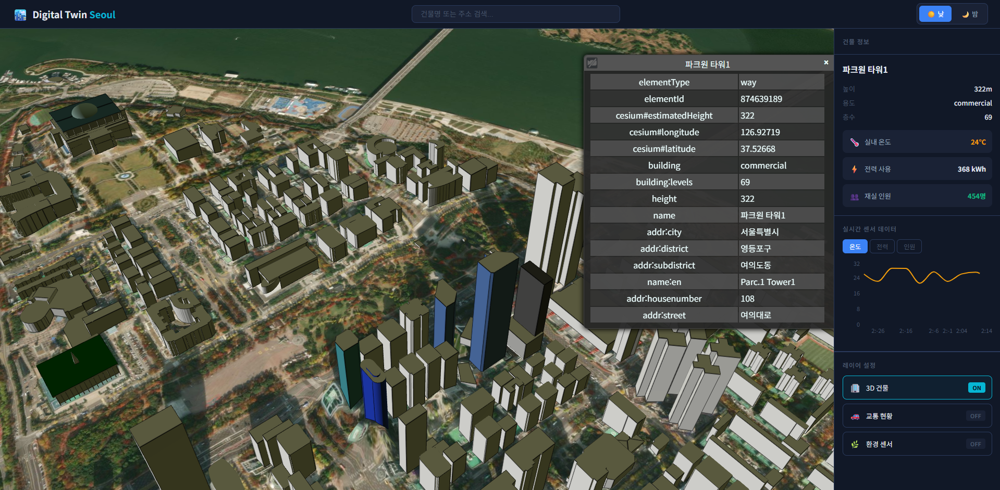

# Digital Twin Seoul

서울 여의도를 배경으로 한 스마트시티 디지털 트윈 대시보드 데모입니다.
실시간 빌딩 센서 데이터와 3D 도시 지도를 결합한 인터랙티브 지리공간 시각화 플랫폼입니다.



---

## 주요 기능

- **3D 도시 시각화** — CesiumJS와 OSM 빌딩 타일셋으로 서울 여의도를 실제 지형 위에 렌더링
- **빌딩 선택 & 정보 조회** — 3D 맵에서 빌딩 클릭 시 높이, 용도, 층수 등 OSM 속성 표시
- **실시간 센서 데이터** — 온도 / 전력 소비 / 재실 인원을 5초마다 갱신하며 시계열 차트로 시각화
- **주야간 전환** — 버튼 하나로 태양 조명 및 시각 효과를 낮/밤 모드로 즉시 전환
- **레이어 관리** — 빌딩 / 교통 / 환경 레이어를 독립적으로 토글
- **빌딩 검색** — 이름 기반 검색 기능

---

## 기술 스택

| 분류 | 기술 |
|------|------|
| 프레임워크 | React 19 + TypeScript |
| 빌드 도구 | Vite 8 |
| 3D 렌더링 | CesiumJS 1.140 |
| 상태 관리 | Zustand 5 |
| 차트 | Recharts 3 |
| 스타일 | CSS Variables (다크 테마) |
| 컴파일러 | React Compiler (자동 메모이제이션) |

---

## 아키텍처

```
src/
├── App.tsx                  # 레이아웃 조합 (Toolbar + Viewer + Dashboard)
├── components/
│   ├── CesiumViewer/        # 3D 뷰어 컴포넌트
│   ├── Toolbar/             # 상단 내비게이션 & 검색
│   ├── Dashboard/
│   │   ├── BuildingInfo     # 선택 빌딩 상세 정보
│   │   └── SensorChart      # 실시간 센서 차트 (Recharts)
│   └── LayerPanel/          # 레이어 토글 패널
├── hooks/
│   ├── useCesium            # Viewer 초기화 & 생명주기 관리
│   ├── useBuildingSelect    # 클릭 이벤트 & OSM 속성 추출
│   └── useSensorData        # 센서 데이터 생성 & 5초 갱신
├── store/
│   └── useStore             # Zustand 전역 상태 (빌딩 선택, 레이어, 시간 모드)
└── data/
    └── mockSensorData       # 시계열 더미 데이터 생성기
```

**데이터 흐름:**

```
빌딩 클릭 → useBuildingSelect → OSM 속성 추출 → Zustand Store 업데이트
                                                        ↓
                                          Dashboard (BuildingInfo + SensorChart)
                                                        ↓
                                          useSensorData (5s polling → 차트 갱신)
```

---

## 주요 구현 포인트

### CesiumJS 3D 뷰어 통합
- OSM Building Tileset으로 실제 서울 빌딩 형상 렌더링
- `JulianDate`를 활용해 낮(09:00) / 밤(21:00) 태양 조명 동적 전환
- 여의도 중심 좌표(126.9246°E, 37.5219°N, 고도 800m)로 카메라 flyTo 초기 위치 설정
- `ScreenSpaceEventHandler`로 3D 객체 클릭 감지

### OSM 속성 추출
3D 픽킹된 객체에서 OpenStreetMap 태그를 직접 추출해 현실적인 빌딩 정보 표시:
```typescript
const properties = {
  name: picked.getProperty('name'),
  height: picked.getProperty('cesium#estimatedHeight'),
  building: picked.getProperty('building'),
  levels: picked.getProperty('building:levels'),
}
```

### 실시간 센서 시뮬레이션
선택된 빌딩에 대해 10포인트 시계열 센서 데이터를 생성하고 5초마다 갱신:
- 온도: 20–30°C 범위
- 전력: 300–500 kWh 범위
- 재실 인원: 100–600명 범위

### CSS 변수 기반 다크 테마
12개의 디자인 토큰으로 일관된 UI를 유지하며 Pretendard / Noto Sans KR 폰트로 한글 최적화.

---

## 로컬 실행

```bash
git clone https://github.com/your-username/digital-twin-demo.git
cd digital-twin-demo
npm install
npm run dev
```

> CesiumJS Ion 액세스 토큰이 필요한 경우 `.env` 파일에 `VITE_CESIUM_ION_TOKEN=your_token`을 추가하세요.

---

## 확장 가능성

이 데모는 실제 서비스로 확장할 수 있는 구조로 설계되어 있습니다:

- **실제 IoT 센서 연동** — REST / WebSocket API로 mockSensorData 교체
- **다중 빌딩 비교** — Zustand 스토어 확장으로 복수 선택 지원
- **고급 필터링** — 용도별, 에너지 효율별 빌딩 필터
- **알림 시스템** — 센서 임계값 초과 시 실시간 알림

---

## 라이선스

MIT
